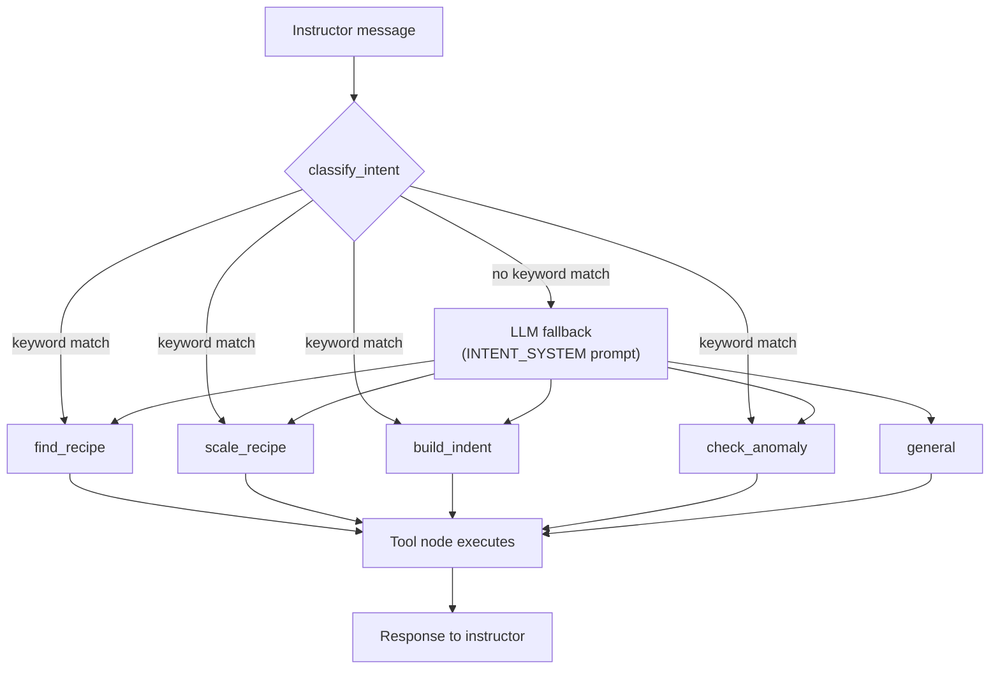

# Patisserie AI — Intent Classifier Evaluation: Solution Doc

## The Primer (evaluation one-liner)

> I will measure exact-match accuracy and LLM-judge agreement on Patisserie AI's
> intent classifier (`_classify_intent` in `app/agent/graph.py`) using a golden
> dataset of 50 cases covering happy-path, edge-case, known-failure, and
> adversarial instructor queries, with code-based exact-match plus a categorical
> LLM-as-judge. Pass bar: 90% exact-match accuracy with zero regressions. I will
> run this in LangSmith and report the delta from a 64% baseline to post-improvement.

## The Framework

| Field | Fill in |
|---|---|
| **Agent under test** | Patisserie AI's intent classifier (`_classify_intent()`, `backend/app/agent/graph.py`) — routes every instructor message to one of 5 categories before any tool runs: `find_recipe`, `scale_recipe`, `build_indent`, `check_anomaly`, `general`. Keyword-first, LLM fallback for anything that matches no keyword. See architecture diagram below. |
| **User outcome** | The instructor gets routed to the right tool on the first try. A wrong route either blocks a useful answer (a baking-science question gets treated as a recipe lookup) or triggers the wrong action entirely (a conceptual question about ratios gets treated as a validate-this-recipe command). |
| **Metrics (3–5)** | (1) Exact-match accuracy vs. ground truth — the primary quality metric. (2) Per-category precision/recall/F1 — diagnostic, shows which categories over/under-trigger. (3) LLM-judge agreement with human failure-category labeling — judge calibration. (4) Regression count vs. prior passing cases — cost/safety of each change. |
| **Judge method** | Exact match (code-based, free) for the primary metric. Categorical LLM-as-judge (sees query + predicted intent, never ground truth) for judge-alignment analysis on failures. A second, independent general-correctness LLM-judge via the LangSmith SDK for cross-validation. |
| **Golden dataset** | 50 cases, hand-written by me: 25 happy / 15 edge / 7 known-failure / 3 adversarial. Every row traced to a specific keyword or regex path in the actual classifier code — not randomly generated. Stored in `evals/golden_dataset.csv`; also uploaded to LangSmith as dataset `patisserie-intent-classifier`. |
| **Pass bar** | 90% exact-match accuracy, with zero regressions against the 16 pre-existing test cases already in `backend/scripts/evaluate.py`. |
| **Instrumentation** | LangSmith traces the real `_classify_intent()` function per row via the SDK (not a Playground-recreated prompt) — logs input, predicted output, exact-match score, and LLM-judge score + reasoning for every run. |
| **Baseline run** | **32/50 (64%)**. LangSmith experiment: `intent-classifier-32d36008` (project `patisserie-intent-eval`). |
| **Failure analysis** | 18 failures at baseline, clustered into 4 root causes: (1) *domain keyword bleed* [12] — a general/conceptual question gets misrouted because it contains an incidental keyword like "ratio" or "recipe"; (2) *scale_recipe wins by dict-order priority* [3] — e.g. "double check" hijacked by "double"; (3) *"portions" hijacks recipe-lookup questions* [2]; (4) *"list...ingredients" regex over-triggers build_indent* [1]. |
| **Improvement hypotheses (3–4)** | (1) Gate 8 ambiguous keywords behind a "is this a WH-question" check so conceptual questions fall to the LLM fallback instead of a keyword shortcut — predicted +12–16%. (2) Tighten the LLM fallback's own system prompt description of `check_anomaly` to require a named recipe — predicted +4–6% (the keyword fix alone can't close this, the bias is in the prompt too). (3) Narrow the compile/list regex override to require "all" alongside "list" — predicted +2%. (4) Exclude "double" from `scale_recipe` when it's part of the "double check" idiom — predicted +2%. |
| **Post-improvement run** | **43/50 (86%)**, +22 points, **zero regressions** — verified against all 50 golden rows and all 16 original `evaluate.py` cases after every single fix. LangSmith experiment: `intent-classifier-cd86cca9`. `intent_exact_match` 86%, `intent_llm_judge` 84% (see note below on why these differ slightly). |
| **What is next** | Top remaining failure mode: "portions" vs. recipe-info-lookup ambiguity (`t022`, `t026`, 2 rows). Deliberately **not** patched — a rule that fixes only these 2 sentences would be reverse-engineered from the exact failures, i.e. overfitting to my own golden set rather than a real agent improvement. A real fix needs a general signal (e.g. detecting an explicit scale verb) or more data from actual usage, not more hand-written examples targeting the same 2 rows. Monitoring strategy for production: track each category's share of classified traffic over time and alert if `general`'s share drops sharply — that's the signature of keyword-bleed regressions creeping back in after future prompt or keyword-list changes. |

## Agent architecture



*(Paste the block above into a Mermaid renderer — e.g. Google Docs' diagram add-on, or mermaid.live — and drop the rendered image into the doc here.)*

---

## Appendix A — The 4 fixes (code, before/after)

All 4 changes are to the **real agent code** (`app/agent/graph.py`, `app/agent/prompts.py`)
— nothing in the eval scripts or the golden dataset was touched. Each was implemented,
tested against its target rows, then verified against the full 50-row set with zero
regressions before moving to the next.

| # | Cluster targeted | File | Fix | Rows fixed |
|---|---|---|---|---|
| 1 | Domain keyword bleeds into the wrong category | `graph.py` | Added `_WEAK_KEYWORDS` + `_is_general_question()`: 8 ambiguous keywords (`ratio`, `correct`, `check`, `review`, `order`, `production day`, `recipe`, `technique`, `how do`, `yield`) are skipped when the query is phrased as a WH-question, falling through to the LLM fallback instead of being hijacked | t028, t033, t034, t046, t048, t049 |
| 2 | Same cluster — LLM fallback's own bias | `prompts.py` | Tightened `INTENT_SYSTEM`: `check_anomaly` now requires a **named** recipe to validate; `general` explicitly covers conceptual ratio/technique questions | t025, t030, t031 |
| 3 | 'list ... ingredients' override over-triggers build_indent | `graph.py` | The compile/list regex now requires `compile`, or `list` together with `all` — a plain "list the ingredients in X recipe" lookup no longer gets treated as an indent-sheet request | t027 |
| 4 | scale_recipe wins by dict-order priority (partial) | `graph.py` | `"double"` no longer matches `scale_recipe` when part of the `"double check"` idiom | t032 |

```python
# Fix 1 -- app/agent/graph.py
_WEAK_KEYWORDS = {
    "check_anomaly": {"ratio", "correct", "check", "review"},
    "build_indent": {"order", "production day"},
    "find_recipe": {"recipe", "technique", "how do"},
    "scale_recipe": {"yield"},
}
_QUESTION_START = re.compile(r"^(what|why|how|does|is|are|can|could|would)\b")

def _is_general_question(low: str) -> bool:
    return bool(_QUESTION_START.match(low.strip()))

is_question = _is_general_question(low)
is_double_check_idiom = bool(re.search(r"\bdouble[\s-]?check", low))  # Fix 4
for intent, keywords in _INTENT_KEYWORDS.items():
    weak = _WEAK_KEYWORDS.get(intent, set())
    for kw in keywords:
        if kw == "double" and is_double_check_idiom:
            continue
        if kw in low and not (kw in weak and is_question):
            return intent
```

```python
# Fix 2 -- app/agent/prompts.py, INTENT_SYSTEM
- check_anomaly: the message names a SPECIFIC recipe already in the system and asks to check,
  validate, or find errors in THAT recipe's measurements against baking thresholds
- general: ...including questions about what a correct/good/ideal ratio or method is in
  general (not about a specific named recipe to validate), even if words like "ratio",
  "correct", or "check" appear
```

```python
# Fix 3 -- app/agent/graph.py
if re.search(r'\bcompile\b.{0,60}\bingredients?\b', low):
    return "build_indent"
if re.search(r'\blist\b.{0,60}\ball\b.{0,60}\bingredients?\b', low):
    return "build_indent"
```

**Why we stopped at 4, deliberately:** a 5th candidate fix (special-casing "portions"
when it co-occurs with a recipe-lookup word, to fix `t022`/`t026`) was reverse-engineered
from exactly those 2 failing sentences rather than from a general linguistic pattern —
that's overfitting to the golden set, not a real improvement to the agent. Left unfixed
on purpose. Same reasoning for the 3 remaining adversarial rows (`t035`, `t036`, `t050`)
— deliberately stacked, arguably ambiguous even for a human, not worth curve-fitting to.

*(Screenshot placeholder: paste a screenshot of the Step 4 · Fix + Delta tab here.)*

## Appendix B — LLM-as-judge (local, Steps 5/6)

Categorical judge — sees only the query + predicted intent, never ground truth —
asked whether each remaining failure is an instance of the largest cluster
("domain keyword bleed"):

```
You are evaluating an intent classifier for a pastry-academy assistant.

Failure category: {title}
Definition: {definition}

Given the User Input and the classifier's Predicted Intent, decide whether the
classifier's mistake is an instance of this failure category.
Return TRUE only when the query's real intent falls outside the Predicted
Intent specifically because of the mechanism described above.
Return FALSE for correct predictions and for all other kinds of mistakes.

Return structured output with fields: label (TRUE or FALSE), reasoning (one sentence).
```

**Judge/human agreement: 42.9% (3/7)** on the remaining 7 failures post-fixes. The
disagreements are legitimate, not noise: with most "clean" keyword-bleed cases already
resolved, what's left are the genuinely ambiguous/adversarial ones where the judge and
the human labeling reasonably differ.

*(Screenshot placeholder: paste a screenshot of the Step 5/6 tabs here.)*

## Appendix C — LangSmith (separate SDK-based evaluation)

- Dataset: `patisserie-intent-classifier` (50 examples, columns `query`/`intent`/`id`)
- Target: the real `_classify_intent()` function, traced via the SDK — not a
  Playground-recreated prompt, since most queries never reach an LLM at all
- Evaluators: free code-based Exact Match, plus a general LLM-as-judge (sees
  query + predicted intent, decides correct/incorrect, blind to ground truth)
- Project: `patisserie-intent-eval` — open **smith.langchain.com** →
  Datasets & Experiments → `patisserie-intent-classifier` to see the experiment runs
- **Result after all 4 fixes:** `intent_exact_match` 43/50 (86%), `intent_llm_judge`
  42/50 (84%) — the two metrics measure different things (ground-truth accuracy vs.
  an LLM's own opinion without seeing ground truth), so a small gap between them is
  expected, not a bug.

*(Screenshot placeholder: paste a screenshot of the LangSmith experiment compare view here.)*
